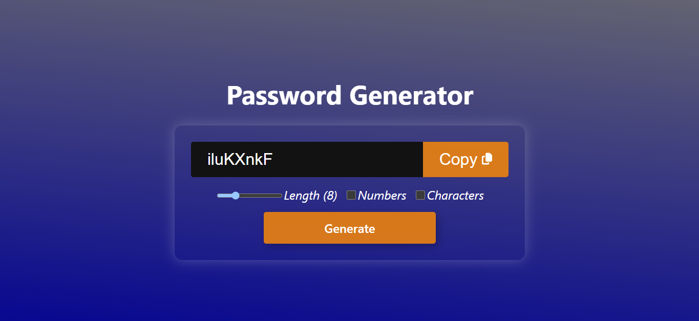

# Password Generator - React App



This is a simple React-based Password Generator tool that allows users to create a random password of specified length and complexity. Users can configure the password by adjusting its length, and by choosing to include numbers or special characters. The password can then be easily copied to the clipboard for use. This project is built using React and modern JavaScript features like `useState`, `useEffect`, `useCallback`, and `useRef`.

## Features
- **Random Password Generation**: Generates a secure password based on user-defined parameters (length, numbers, special characters).
- **Password Length Control**: Slider control to adjust the password length (between 4 and 20 characters).
- **Customization**: Options to include numbers and special characters for additional security.
- **Copy to Clipboard**: One-click functionality to copy the generated password to your clipboard.
- **Responsive Design**: The app adapts to different screen sizes, ensuring usability across devices.

## Technologies Used
- **React**: For building the user interface and managing state.
- **useState**: To manage dynamic state for the password, length, and options.
- **useEffect**: To regenerate the password whenever the parameters change.
- **useRef**: To handle the password input field and clipboard interaction.
- **JavaScript**: For the logic of password generation and interactivity.
- **CSS**: Styling and layout for the app's UI.

## Getting Started

### Prerequisites
Ensure you have Node.js and npm (Node Package Manager) installed on your machine. You can download and install them from the official [Node.js website](https://nodejs.org/).

### Installation
1. Clone the repository to your local machine:
    ```bash
    git clone https://github.com/yourusername/password-generator.git
    ```
2. Navigate to the project directory:
    ```bash
    cd password-generator
    ```
3. Install the necessary dependencies:
    ```bash
    npm install
    ```
4. Start the development server:
    ```bash
    npm start
    ```

This will run the app locally and open it in your web browser at `http://localhost:3000`.

### Live Demo
You can also view the live demo of the project hosted on [Vercel](https://password-generator-jha.vercel.app/).

## How It Works
1. **Password Length**: Use the slider to adjust the length of your password (between 4 and 20 characters).
2. **Include Numbers**: Check the "Numbers" option to include numeric digits in your password.
3. **Include Special Characters**: Check the "Characters" option to include special symbols (e.g., `!@#$%^&*()`).
4. **Generate Password**: Click the "Generate" button to create a new random password based on your selected options.
5. **Copy Password**: After generating the password, click the "Copy" button to copy the password to your clipboard.

## License
This project is licensed under the MIT License - see the [LICENSE](LICENSE) file for details.
